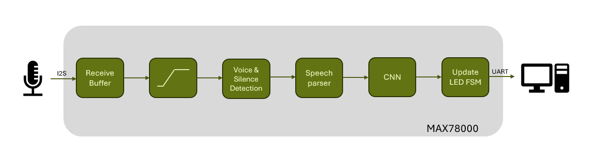
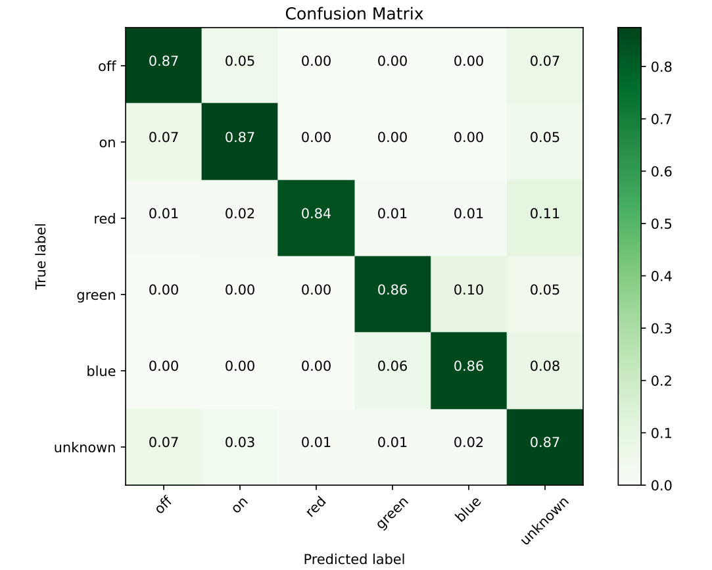

# Keyword Spotting on the MAX78000

This the repo of my final project of the ML on MCU lecture. I have implemented keyword spotting on the MAX78000FTHR evaluation board. The demo involves changing of the LED state via voice commands such as 'red', 'green', 'blue', 'on' and 'off'.

## RGB Dataset

For the keywords 'red', 'green' and 'blue' I had to gather my own dataset. It can be found within ```ai8x-synthesis/demos/final_demo_rgb/Utility/```

## Demo

The flashable source code for the MAX78000FTHR demo can be viewed in ```ai8x-synthesis/demos/final_demo_rgb/```. Following flowchart depicts the working principle of the audio processing.



## Results

Below is the normalized confusion matrix on the test set of the fully quantized model which was synthesized and deployed on the MAX78000.


